# zlim-color

zlim 引擎的颜色库，移植自 `bevy_color`。

提供多种颜色空间的表示、全空间互转、颜色操作、调色板以及 GPU 集成。

## 颜色空间

每种颜色空间都是一个独立的 Rust 类型；所有空间之间都可以相互转换（`From`/`Into`）：



- `Srgba` / `LinearRgba` —— 标准（gamma 编码）与线性 sRGB。光照计算应使用 `LinearRgba`。
- `Hsla` / `Hsva` / `Hwba` —— 圆柱空间（色相/饱和度/明度、-明度值、-白度黑度）。
- `Laba` / `Lcha` —— CIE Lab / LCH。
- `Oklaba` / `Oklcha` —— 感知均匀的 Oklab / Oklch。
- `Xyza` —— CIE 1931 XYZ（基础空间）。
- `Okhsla` / `Okhsva` / `Okhwba` —— Okhsl / Okhsv / Okhwb，相对于 sRGB（Rec. 709）色域定义。

## Color

- `Color` —— 可表示任意具体颜色空间的枚举。当需要把颜色存入无法泛型化的数据结构时使用。

## 特征（Trait）

- `Luminance` / `Gray` / `Mix` / `Alpha` / `Hue` / `Saturation` —— 每种颜色空间都实现的
  颜色操作；`Mix` 沿短弧处理色相环绕。
- `ColorToComponents` / `ColorToPacked` —— 与 `[f32; 4]`、`Vec3`/`Vec4` 及打包的
  `[u8; 4]` 之间的转换。
- `EuclideanDistance` —— 同一空间内两个颜色之间的距离。

## 插值

- `StableInterpolate`（来自 `zlim_math`）：线性/感知线性空间按通道插值；圆柱空间经由
  `Mix` 插值，使色相沿短弧环绕；`Srgba` 在线性空间插值以获得感知正确的效果。

## 曲线

- `ColorCurve<T>` —— 作为 `zlim_math::curve::Curve` 的颜色渐变，基于 `EvenCore` 并以
  `Mix` 插值。

## 调色板

- `palettes::basic` —— 基础颜色（`RED`、`GREEN`、`BLUE` 等）。
- `palettes::css` —— CSS 命名颜色。
- `palettes::tailwind` —— Tailwind 调色板。

## 示例

```rust
use zlim_color::{Color, Hsla, Mix, Srgba};

let srgba = Srgba::new(0.5, 0.2, 0.8, 1.0);

// 所有空间之间均可相互转换：
let hsla: Hsla = srgba.into();
assert_eq!(hsla.alpha(), 1.0);

// 混合与透明度操作：
let mixed = srgba.mix(&Srgba::WHITE, 0.5);
assert_eq!(mixed.red, 0.75);

// `Color` 枚举可表示任意空间：
let color = Color::from(srgba);
assert_eq!(color.to_srgba(), srgba);
```
